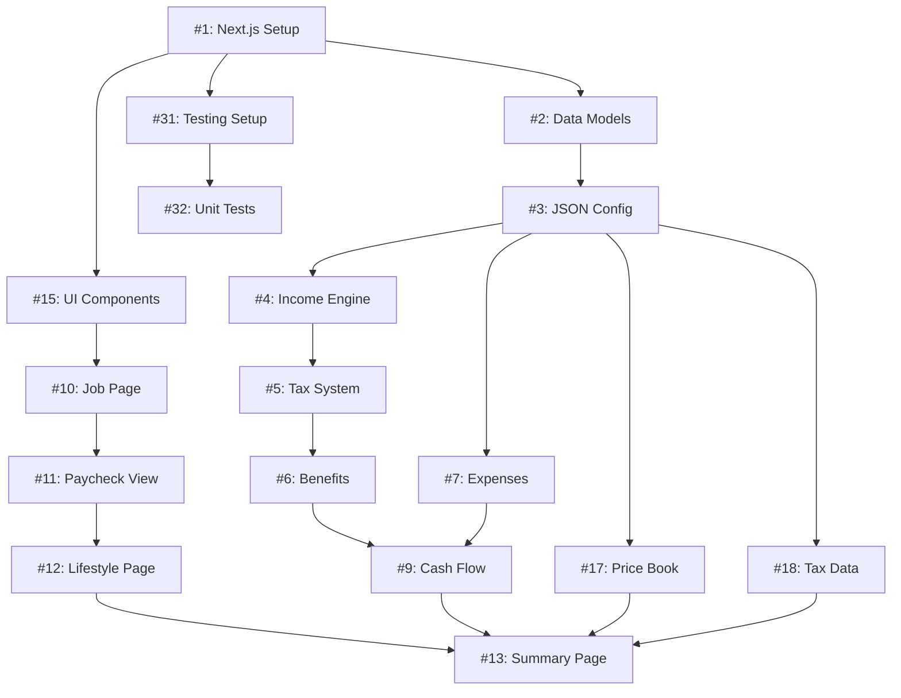

# Work Items Dependency Map

This document shows the relationships and dependencies between the 37 work items for implementing the Adulting Simulator.

## Legend
- 🔴 **High Priority** - Critical for MVP
- 🟡 **Medium Priority** - Important for full experience
- 🟢 **Low Priority** - Nice-to-have enhancements
- → Depends on
- ⚡ Can be done in parallel

---

## Phase 1: Project Setup & Foundation

```
🔴 #1: Initialize Next.js Project
    │
    ├─→ 🔴 #2: Define Core Data Models
    │       │
    │       └─→ 🔴 #3: Create JSON Configuration Files
    │
    └─→ 🔴 #31: Set Up Testing Infrastructure
```

**Start Here!** All other work depends on these foundation items.

---

## Phase 2: Core Game Logic

```
Dependencies: #1, #2, #3, #31

🔴 #4: Income Calculation Engine ⚡
    │
    └─→ 🔴 #5: Tax Calculation System
            │
            └─→ 🔴 #6: Benefits Deduction System
                    │
                    └─→ 🔴 #9: Monthly Cash Flow Calculator

🔴 #7: Expense Tracking System ⚡
    │
    └─→ 🔴 #9: Monthly Cash Flow Calculator

🟡 #8: Random Life Events System ⚡
    │
    └─→ 🔴 #9: Monthly Cash Flow Calculator

🔴 #32: Write Unit Tests (parallel with above)
    └─→ Tests all #4-9
```

**Critical Path:**
1. Build #4 (Income)
2. Build #5 (Taxes) 
3. Build #6 (Benefits)
4. Build #7 (Expenses) in parallel
5. Build #8 (Life Events) in parallel
6. Integrate all into #9 (Cash Flow)
7. Test everything with #32

---

## Phase 3: UI Components

```
Dependencies: #1, #2

🟡 #15: Build Reusable UI Components
    │
    ├─→ 🔴 #10: Job Selection Page
    │       │
    │       └─→ 🔴 #11: Paycheck Detail View
    │               │
    │               └─→ 🔴 #12: Lifestyle/Expenses Page
    │                       │
    │                       └─→ 🔴 #13: Monthly Summary Page
    │                               │
    │                               └─→ 🟡 #14: "What If" Tool
    │
    └─→ 🟡 #16: Data Visualization Charts
            │
            └─→ Used in #13, #14, #27

🔴 #29: Responsive Mobile Layout
    └─→ Applied to all pages (#10-14)

🟡 #33: Write Component Tests
    └─→ Tests all components
```

**Critical Path:**
1. Build #15 (UI Components) first
2. Build pages in sequence: #10 → #11 → #12 → #13
3. Add #16 (Charts) for visualizations
4. Build #14 (What If) tool
5. Ensure #29 (Mobile) works throughout
6. Test with #33

---

## Phase 4: Data & Configuration

```
Dependencies: #2, #3

🟡 #17: Populate Comprehensive Price Book ⚡
    └─→ Enhances #3

🔴 #18: Configure Accurate Tax Information ⚡
    └─→ Enhances #3

🟡 #19: Define Benefit Plan Options ⚡
    └─→ Enhances #3

🟡 #20: Configure Random Life Events ⚡
    └─→ Enhances #3
```

**Can be done in parallel!** All four items enhance the JSON files from #3.

**Note:** #17 and #18 are higher priority for MVP.

---

## Phase 5: Features & Polish

```
Dependencies: Various (see below)

🟡 #21: Local Storage (depends on: #2, #9)
    └─→ Save/load game state

🟢 #22: Advanced Tax Mode (depends on: #5, #18)
    └─→ Enhances tax system

🟢 #23: Stress Meter (depends on: #7, #9)
    └─→ Game feedback feature

🟡 #24: Credit Score Tracking (depends on: #7, #9)
    └─→ Financial education feature

🟡 #25: Tutorial/Onboarding (depends on: #10-13)
    └─→ User experience

🟢 #26: Settings Page (depends on: #1, #15)
    └─→ User preferences

🟢 #27: Comparison View (depends on: #9, #16)
    └─→ Educational tool

🟢 #28: Export/Share (depends on: #9, #13)
    └─→ Sharing feature
```

**Priority within Phase 5:**
1. #24 (Credit Score) - Educational value
2. #25 (Tutorial) - User onboarding
3. #21 (Storage) - User retention
4. Others are enhancements

---

## Testing & Quality Assurance

```
🔴 #31: Testing Infrastructure (Phase 1)
    │
    ├─→ 🔴 #32: Unit Tests (Phase 2)
    │
    └─→ 🟡 #33: Component Tests (Phase 3)

🟡 #34: Accessibility Audit ⚡
    └─→ Applies to all UI (#10-16)

🟢 #35: Performance Optimization ⚡
    └─→ Applies to entire app
```

**Testing Timeline:**
- #31: Set up with Phase 1
- #32: Write alongside Phase 2 logic
- #33: Write alongside Phase 3 UI
- #34: Run before final release
- #35: Optimize before deployment

---

## Deployment

```
Dependencies: All previous phases complete

🟡 #36: Set Up Deployment Pipeline
    └─→ Final deployment preparation

🟢 #37: Create Demo Mode (depends on: #17-20)
    └─→ Marketing/showcase feature

🔴 #30: Documentation (ongoing)
    └─→ Updated throughout development
```

**Deployment Order:**
1. Complete #30 (ensure docs are current)
2. Run #34 (accessibility check)
3. Run #35 (performance optimization)
4. Set up #36 (deployment)
5. Optionally add #37 (demo mode)

---

## MVP Critical Path

**Minimum Viable Product (15 issues):**



**MVP Sequence:**
1. **Week 1-2:** Issues #1, #2, #3, #31 (Foundation)
2. **Week 3-4:** Issues #4, #5, #6, #7, #9, #32 (Logic)
3. **Week 5:** Issues #15, #17, #18 (Components & Data)
4. **Week 6-7:** Issues #10, #11, #12, #13 (Pages)
5. **Test & Deploy**

---

## Parallel Work Opportunities

### Can Work Simultaneously:

**During Phase 1:**
- Developer A: #1 (Next.js)
- Developer B: #2 (Types)
- Developer C: #31 (Testing)

**During Phase 2:**
- Developer A: #4, #5, #6 (Income → Taxes → Benefits)
- Developer B: #7 (Expenses)
- Developer C: #8 (Life Events)
- All merge into: #9 (Cash Flow)

**During Phase 3:**
- Developer A: #10, #11, #12, #13 (Pages, sequential)
- Developer B: #15, #16 (Components & Charts)
- Developer C: #29 (Mobile responsive)

**During Phase 4:**
- All four data issues (#17-20) can be done in parallel

**During Phase 5:**
- Most features (#21-28) can be developed in parallel

---

## Risk Areas & Dependencies

### High-Risk Items (complex or critical):
- **#5: Tax Calculation** - Complex logic, must be accurate
- **#9: Cash Flow** - Integrates everything, potential bottleneck
- **#13: Summary Page** - Complex UI with multiple data sources
- **#29: Mobile Layout** - Affects all pages, test thoroughly

### Blocked By Multiple Dependencies:
- **#9** (Cash Flow) - Blocked by #4, #5, #6, #7, #8
- **#13** (Summary) - Blocked by #9, #16, #17, #18
- **#14** (What If) - Blocked by #9, #13, #16

### Quick Wins (easy, high value):
- **#3** - Create JSON files (easy, enables other work)
- **#15** - UI components (straightforward, reusable)
- **#17** - Populate data (research + data entry)
- **#21** - Local storage (well-documented pattern)

---

## Recommended Team Structure

### For Solo Developer:
Follow the MVP critical path sequentially.
**Timeline:** 8-12 weeks

### For 2 Developers:
- **Developer 1:** Backend/Logic (Phase 2)
- **Developer 2:** Frontend/UI (Phase 3)
**Timeline:** 6-8 weeks

### For 3 Developers:
- **Developer 1:** Core Logic (#4-9)
- **Developer 2:** UI Pages (#10-13)
- **Developer 3:** Data & Features (#17-20, #21-28)
**Timeline:** 4-6 weeks

---

## Milestone Suggestions

### Milestone 1: Foundation (Week 2)
- #1, #2, #3, #31 complete
- Can run empty Next.js app
- Types defined, sample data exists

### Milestone 2: Working Calculations (Week 4)
- #4, #5, #6, #7, #9 complete
- #32 tests passing
- Can calculate monthly budget programmatically

### Milestone 3: MVP UI (Week 7)
- #10, #11, #12, #13 complete
- #15, #29 complete
- Can play through one month

### Milestone 4: Feature Complete (Week 10)
- #8, #14, #16, #17-20 complete
- All features implemented
- Ready for polish

### Milestone 5: Release Ready (Week 12)
- #21-28 complete (selected features)
- #33, #34, #35 complete
- #36 deployed
- #30 documentation complete

---

## Decision Points

### After Milestone 1:
**Decision:** Simple or advanced tax mode first?
- **Simple:** Faster MVP, easier to understand
- **Advanced:** More accurate, better learning

### After Milestone 2:
**Decision:** Which Phase 5 features are essential?
- **Must-have:** #24 (Credit Score), #25 (Tutorial)
- **Should-have:** #21 (Storage), #16 (Charts)
- **Nice-to-have:** #22, #23, #26, #27, #28

### After Milestone 3:
**Decision:** Deploy MVP or continue to full feature set?
- **Deploy early:** Get user feedback, iterate
- **Complete first:** More polished initial release

---

## Summary Statistics

**Total Work Items:** 37

**By Priority:**
- 🔴 High: 15 issues (MVP critical)
- 🟡 Medium: 15 issues (Important)
- 🟢 Low: 7 issues (Nice-to-have)

**By Phase:**
- Phase 1 (Setup): 3 issues
- Phase 2 (Logic): 6 issues  
- Phase 3 (UI): 7 issues
- Phase 4 (Data): 4 issues
- Phase 5 (Features): 8 issues
- Testing: 5 issues
- Deployment: 2 issues
- Documentation: 2 issues

**Parallelization Potential:**
- Sequential work: ~15 issues (dependencies)
- Parallel work: ~22 issues (independent)

**Estimated Effort:**
- MVP: 4-6 weeks (15 issues)
- Full: 8-12 weeks (37 issues)
- With 3 developers: 4-6 weeks (37 issues)

---

## Quick Reference: Issue Numbers

### Foundation
#1 Next.js, #2 Types, #3 JSON, #31 Testing

### Logic  
#4 Income, #5 Taxes, #6 Benefits, #7 Expenses, #8 Events, #9 Cash Flow

### UI
#10 Job, #11 Paycheck, #12 Lifestyle, #13 Summary, #14 What If, #15 Components, #16 Charts

### Data
#17 Prices, #18 Tax Data, #19 Benefits, #20 Events

### Features
#21 Storage, #22 Advanced Tax, #23 Stress, #24 Credit, #25 Tutorial, #26 Settings, #27 Compare, #28 Export

### Quality
#29 Mobile, #32 Unit Tests, #33 Component Tests, #34 A11y, #35 Performance

### Deploy
#30 Docs, #36 Deploy, #37 Demo

---

This dependency map should help with project planning, task assignment, and understanding the relationships between all work items! 🗺️
